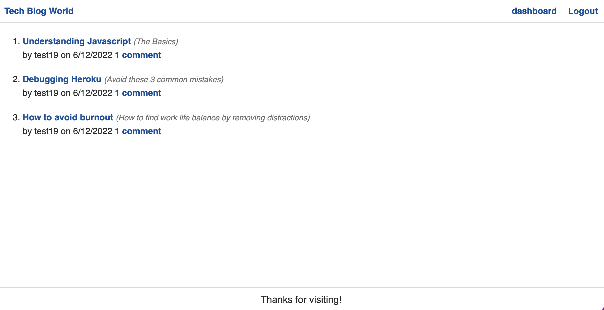

# tech-blog-MVC

## Description

Use this app to create short blog posts. Make a user account and explore the site to find functionality of creating posts, commenting on posts, deleting posts, and editing post titles. 

## Table of Contents

Please reference the sidebar 'explorer' to view the file structure if needed

### Installation

run npm init and confirm that the listed dependencies in package.json have been downloaded

### Usage

The site is currently under construction to allow for longer blog posts, as of now only titles and subtitles are implemented. You may be able to add more content using the comment feature. 

### License

Open-source

### Contributors

Jake Lauterstein 

### Tests

n/a

### Screenshot

### Github
github profile: [https://github.com/jakelauterstein/tech-blog-MVC.git](https://github.com/jakelauterstein/tech-blog-MVC.git)

### Heroku
heroku app (deployed): [https://secret-wildwood-81226.herokuapp.com/](https://secret-wildwood-81226.herokuapp.com/)

### Questions

Should you have any questions/comments/concerns please reach out to the email listed below:

email address: [jakelauterstein@gmail.com](mailto:jakelauterstein@gmail.com)
